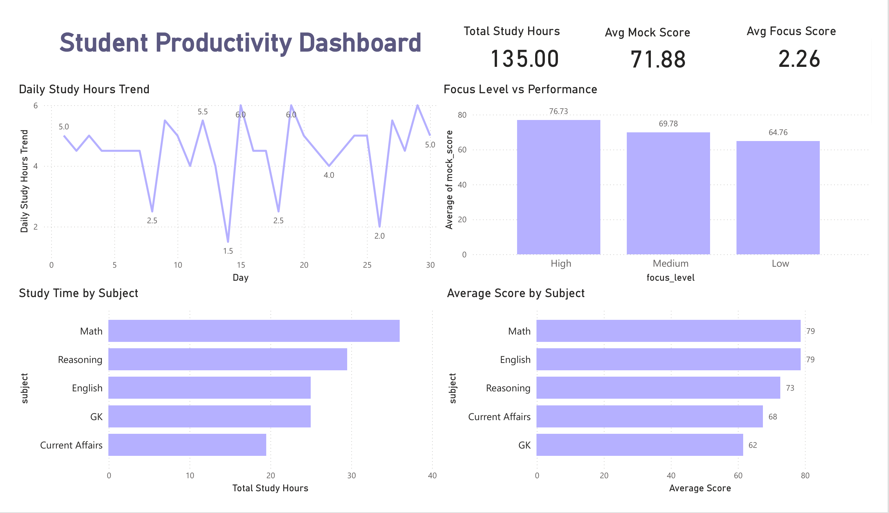

# 📊 Student Productivity Dashboard

<div align="center">



<br/>

[](https://powerbi.microsoft.com/)
[](https://www.postgresql.org/)
[](https://www.microsoft.com/excel)
[](.)

</div>

---

## 🧠 Problem Statement

> *"A student studies daily — but has no idea where time is going, whether scores are improving, or which subject needs more attention."*

Most students track **effort** but not **data**. This project bridges that gap by turning raw study logs into actionable insights — just like a fitness app, but for academics. 📚

---

## 💡 Project Overview

The **Student Productivity Dashboard** is a data analytics project that tracks and visualizes a student's study behavior over 30 days.

It answers questions like:
- 📌 Which subject consumes the most time?
- 📌 Does more study = better score?
- 📌 Where is consistency breaking?
- 📌 Which subject needs urgent attention?

---

## 🔍 Key Insights

- High focus sessions produced the highest average mock scores.
- Math received the maximum study time.
- English showed the strongest performance despite fewer study hours.
- Consistent daily study patterns improved outcomes.

## 🛠️ Tech Stack

---

| Tool | Purpose |
|------|---------|
| 📊 **Power BI** | Interactive dashboard & visualizations |
| 🗄️ **PostgreSQL** | Data cleaning, transformation & analysis |
| 📁 **Excel / CSV** | Raw data storage & preparation |

---

## 📈 Dashboard Highlights

| KPI | Value |
|-----|-------|
| 📚 Total Study Hours | **135 hrs** |
| 🎯 Avg Mock Score | **71.88 / 100** |
| 🧠 Avg Focus Score | **2.26 / 3** |
| 🏆 Best Subject | **Math & English (79 avg)** |
| ⚠️ Weakest Subject | **GK (62 avg)** |

### Charts Included
- 📈 **Daily Study Hours Trend** — Spot consistency & dips
- 🏋️ **Study Time by Subject** — Where is time going?
- 🎯 **Avg Score by Subject** — Performance comparison
- 🔥 **Focus Level vs Performance** — High focus = better scores (proven!)

---

## 🔍 Key Insights

```
✅ High Focus   →  Avg Score: 76.73
⚠️ Medium Focus →  Avg Score: 69.78
❌ Low Focus    →  Avg Score: 64.76
```

- 📌 **Math** received highest study hours (38+ hrs) — showed consistent score improvement (68 → 87)
- 📌 **GK** is the weakest subject despite moderate study time — needs strategy change, not just more hours
- 📌 **Consistency dips** observed on Day 8, 14, 18 & 26 — low focus days correlate with score drops
- 📌 **Focus Level** is a stronger predictor of performance than raw study hours alone

---

## 🗄️ SQL Analysis Performed

```sql
-- Subject-wise total study hours
SELECT subject, SUM(study_hours) AS total_hours
FROM study_log GROUP BY subject ORDER BY total_hours DESC;

-- Focus level impact on performance
SELECT focus_level, ROUND(AVG(mock_score), 2) AS avg_score
FROM study_log GROUP BY focus_level ORDER BY avg_score DESC;

-- Score improvement trend over 30 days
SELECT date, subject, AVG(mock_score) AS daily_avg
FROM study_log GROUP BY date, subject ORDER BY date;
```

---

## 🎤 One-Line Project Summary

> *"Built a Student Productivity Dashboard using SQL and Power BI to analyze 30-day study patterns, revealing that focus quality — not just study hours — is the biggest driver of mock test performance."*

---

## 👤 Author

**Nitish**
- 🔗 [LinkedIn](https://www.linkedin.com/in/nitish-redhu/)
- 💻 [GitHub](https://github.com/Nitinredhu)

---

<div align="center">

⭐ **If you found this useful, drop a star!** ⭐

*Built with 💜 and data-driven thinking*

</div>
